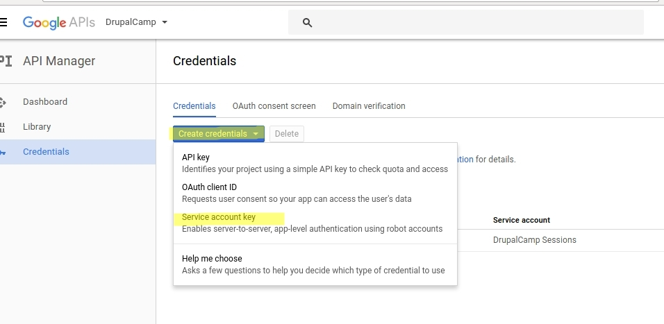
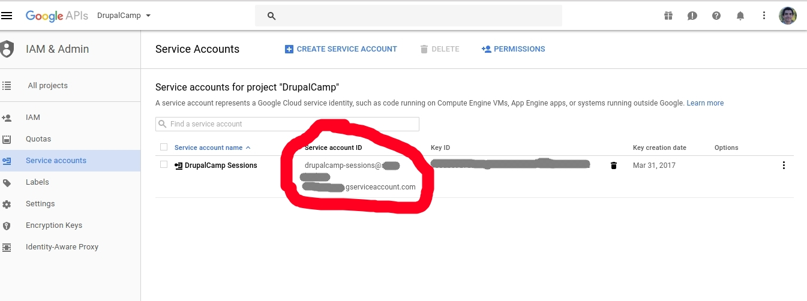

# TimesheetBot

Slack agent to prompt users for timesheets / automatically fill CIR-CII sheets

## Requirements

### Slack application

Have admin rights to a Slack App

### Have a GCP projet configured

Start by creating a service account at the Google Developer Console:

1. Open https://console.developers.google.com/apis/library


2. Enable it and create a project:


3. At Credentials, create a service account:



4. Keep defaults at the next form and click Create. Save the resulting private key file in a directory where your application can read it:


5. Next, click on “Manage Service accounts”:


6. Copy the email address of your service account:



7. Grant permission to the service account to the spreadsheet:


## Development

### Requirements

- Docker and docker-compose
- Python3.10

### Launch development server

- Create de virtual environment

```
python -m venv env
source env/bin/activate
```

- Install dependencies

```
python setup.py install
pip install -r requirements.txt
pip install -e .
```

- Create docker external volume

```
docker volume create timesheetbot_pgdata
```

- Launch docker-compose 

```
docker compose up
```

- In a new terminal session, launch Django migration to setup database

```
python timesheetbot/manage.py migrate
```

- Launch Django development server

```
python timesheetbot/manage.py runserver
```

Development server will be reachable at http://127.0.0.1:8000/

## Build / deploy

Login to your docker repository.

To build and push:
```bash
export DOCKER_IMAGE={MY_DOCKER_REGISTRY:MY_DOCKER_REPOSITORY}
make docker-build
make docker-push
```

Now, you must create a `values.yaml` file to override the default configuration `helm-chart/values.yaml` and configure the application. Please consult the default values.yaml file for a complete documentation.

Then use `helm` to deploy to a Kubernetes cluster:
```bash
helm upgrade \
  --install \
  --wait \
  --atomic \
  -f {PATH_TO_MY_SECRET_VALUES.yaml} \
  timesheetbot
  helm-chart/timesheetbot
```

## How to add / setup a new employee ?

TODO
